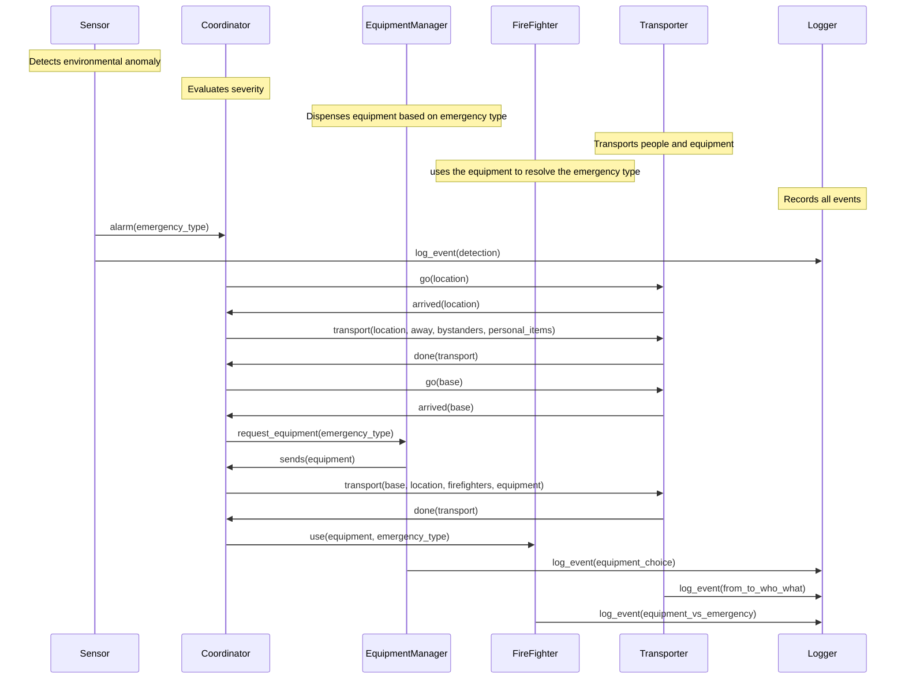

```mermaid
sequenceDiagram
    participant S as Sensor
    participant C as Coordinator
    participant E as EquipmentManager
    participant F as FireFighter
    participant T as Transporter
    participant L as Logger

    Note over S: Detects environmental anomaly
    Note over C: Evaluates severity
    Note over E: Dispenses equipment based on emergency type
    Note over T: Transports people and equipment
    Note over F: uses the equipment to resolve the emergency type
    Note over L: Records all events

    S->>C: alarm(emergency_type)
    S->>L: log_event(detection)
    
    C->>T: go(location)
    T->>C: arrived(location)
    C->>T: transport(location, away, bystanders, personal_items)
    T->>C: done(transport)
    C->>T: go(base)
    T->>C: arrived(base)
    C->>E: request_equipment(emergency_type)
    E->>C: sends(equipment)
    C->>T: transport(base, location, firefighters, equipment)
    T->>C: done(transport)
    C->>F: use(equipment, emergency_type)
    E->>L: log_event(equipment_choice)
    T->>L: log_event(from_to_who_what)
    F->>L: log_event(equipment_vs_emergency)

    
``` 