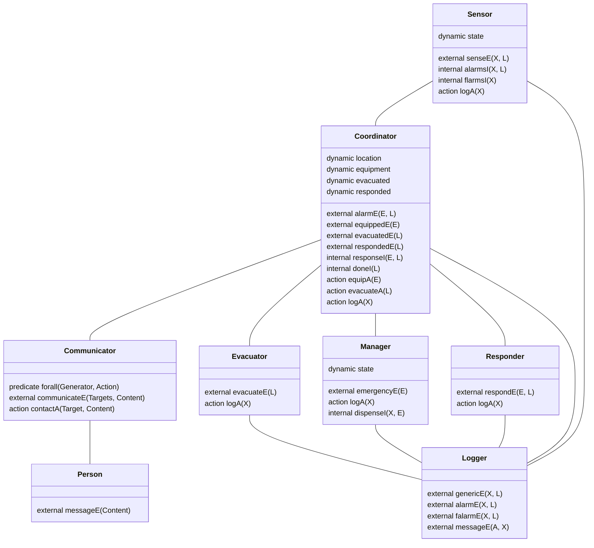

```mermaid
classDiagram
    direction TB
    Sensor :  dynamic state
    Sensor:   external senseE(X, L)
    Sensor:   internal alarmsI(X, L)
    Sensor:   internal flarmsI(X)
    Sensor:   action   logA(X)

    Coordinator :  dynamic location
    Coordinator :  dynamic equipment
    Coordinator :  dynamic evacuated
    Coordinator :  dynamic responded
    Coordinator:   external alarmE(E, L)
    Coordinator:   external equippedE(E)
    Coordinator:   external evacuatedE(L)
    Coordinator:   external respondedE(L)
    Coordinator:   internal responseI(E, L)
    Coordinator:   internal doneI(L)
    Coordinator:   action   equipA(E)
    Coordinator:   action   evacuateA(L)
    Coordinator:   action   logA(X)

    Evacuator:   external evacuateE(L)
    Evacuator:   action   logA(X)

    Manager :  dynamic state
    Manager:   external emergencyE(E)
    Manager:   action   logA(X)
    Manager:   internal   dispenseI(X, E)

    Responder:   external respondE(E, L)
    Responder:   action   logA(X)


    Communicator:   predicate forall(Generator, Action)
    Communicator:   external communicateE(Targets, Content)
    Communicator:   action   contactA(Target, Content)

    Person:   external messageE(Content)

    Logger:   external genericE(X, L)
    Logger:   external alarmE(X, L)
    Logger:   external falarmE(X, L)
    Logger:   external messageE(A, X)

    Sensor -- Coordinator
    Coordinator -- Communicator
    Coordinator -- Evacuator
    Coordinator -- Manager
    Coordinator -- Responder

    Communicator -- Person

    Sensor -- Logger
    Coordinator -- Logger
    Evacuator -- Logger
    Manager -- Logger
    Responder -- Logger
```