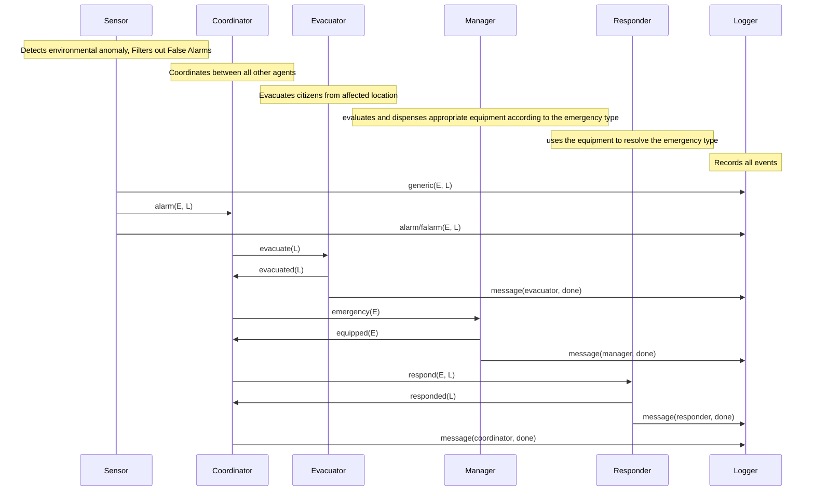

```mermaid
sequenceDiagram
    participant S as Sensor
    participant C as Coordinator
    participant E as Evacuator
    participant M as Manager
    participant R as Responder
    participant L as Logger

    Note over S: Detects environmental anomaly, Filters out False Alarms
    Note over C: Coordinates between all other agents
    Note over E: Evacuates citizens from affected location
    Note over M: evaluates and dispenses appropriate equipment according to the emergency type
    Note over R: uses the equipment to resolve the emergency type
    Note over L: Records all events

    S->>L: generic(E, L)
    S->>C: alarm(E, L)
    S->>L: alarm/falarm(E, L)


    C->>E: evacuate(L)
    E->>C: evacuated(L)
    E->>L: message(evacuator, done)
    C->>M: emergency(E)
    M->>C: equipped(E)
    M->>L: message(manager, done)
    C->>R: respond(E, L)
    R->>C: responded(L)
    R->>L: message(responder, done)
    C->>L: message(coordinator, done)

    
``` 